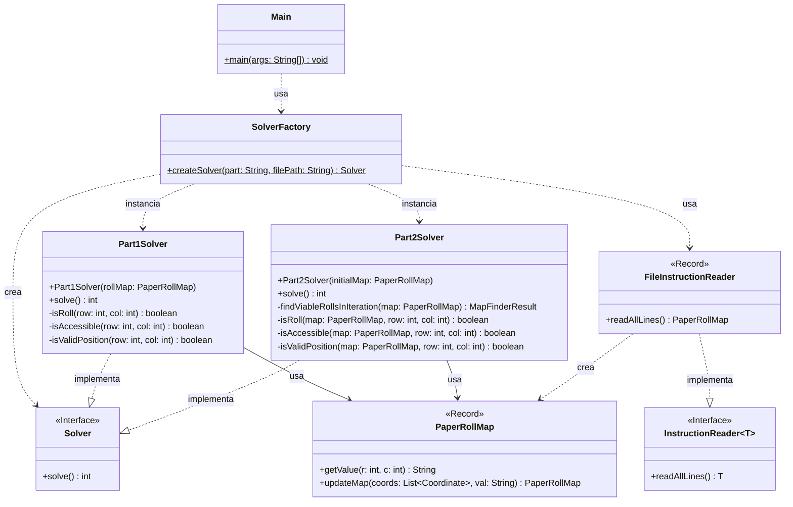

# Advent of Code 2025 - Día 4: Gestión de Rollos de Papel

Este proyecto contiene la solución para el **Día 4** del Advent of Code 2025. El desafío consiste en procesar un mapa de rollos de papel representados en una cuadrícula, identificando aquellos que son "accesibles" según reglas de adyacencia y simulando procesos de extracción.

## Diseño y Arquitectura

En este proyecto se aplican estrictamente los principios SOLID y Clean Code, junto con patrones de diseño estratégicos para garantizar un código mantenible, extensible y testeable.

### 1. Principios SOLID

- **Single Responsibility Principle (SRP)**:
  - `SolverFactory`: Responsable únicamente de la creación de los objetos Solver.
  - `FileInstructionReader`: Responsable de la lectura y parseo del archivo de entrada hacia un modelo de objetos (`PaperRollMap`).
  - `Part1Solver` / `Part2Solver`: Contienen la lógica específica de resolución para cada parte del problema (conteo estático vs simulación iterativa).
  - `PaperRollMap`: Record inmutable que modela el estado de la cuadrícula y sus operaciones básicas.
- **Open/Closed Principle (OCP)**:
  - El sistema es extensible mediante interfaces. Se pueden agregar nuevos tipos de `InstructionReader` sin modificar los Solvers.
  - Para agregar una nueva lógica de resolución (ej. Parte 3), basta con crear una nueva implementación de `Solver` y registrarla en la fábrica.
- **Liskov Substitution Principle (LSP)**:
  - `Part1Solver` y `Part2Solver` implementan la interfaz `Solver`, siendo intercambiables para el cliente (`Main`).
  - `FileInstructionReader` implementa `InstructionReader` y puede ser sustituido por cualquier otra fuente de datos sin romper el sistema.
- **Interface Segregation Principle (ISP)**:
  - `InstructionReader` es una interfaz específica que define un contrato claro asociado a una única funcionalidad (leer líneas y devolver un objeto de dominio).
- **Dependency Inversion Principle (DIP)**:
  - Los módulos de alto nivel (`Main`) dependen de abstracciones (`Solver`, `InstructionReader`), no de las implementaciones concretas de bajo nivel.

### 2. Patrones de Diseño

Se han implementado patrones de diseño para resolver problemas de creación y comportamiento:

- **Strategy Pattern (Estrategia)**:

  - La interfaz `Solver` define la estrategia de resolución del problema principal. `Part1Solver` y `Part2Solver` son estrategias concretas que encapsulan los algoritmos de cada parte del día.

- **Factory Pattern (Fábrica)**:

  - `SolverFactory`: Centraliza la creación de los Solvers. Basado en un parámetro (tipo "A" o "B"), decide qué estrategia de solver instanciar, orquestando la lectura de datos mediante el `InstructionReader`.

- **Dependency Injection**:
  - Las dependencias principales (el modelo `PaperRollMap`) se inyectan en los constructores de `Part1Solver` y `Part2Solver`, separando la construcción del grafo de objetos de su uso.

### 3. Clean Code y Refactorización

Se ha prestado especial atención a la legibilidad y mantenimiento del código:

- **Constants**: Uso de constantes (`ROLL_SYMBOL`, `MAX_NEIGHBORS`) para eliminar "magic numbers/strings".
- **Meaningful Names**: Nombres de variables descriptivos (`rowCount`, `neighborRow`) en lugar de abreviaturas (`R`, `nr`).
- **Small Methods**: Extracción de lógica compleja en métodos privados (`isRoll`, `isValidPosition`, `isAccessible`) para reducir la complejidad cognitiva de los algoritmos.

### 4. Diagrama de Arquitectura

### 5. Estructura del Proyecto

La estructura de paquetes refleja la separación de responsabilidades:

- `software.aoc.day4`: Clases base, interfaces comunes y fábricas (`Solver`, `SolverFactory`, `InstructionReader`, `FileInstructionReader`, `PaperRollMap`, `Main`).
- `software.aoc.day4.a`: Implementación concreta para la Parte 1 (`Part1Solver`).
- `software.aoc.day4.b`: Implementación concreta para la Parte 2 (`Part2Solver`).

## Ejecución del Proyecto

El proyecto es una aplicación Java estándar gestionada con Maven.

### Requisitos

- Java 17 o superior.
- Maven.

### Cómo Ejecutar

La clase principal `Main` ejecuta ambas partes secuencialmente:

- Ejecutar `software.aoc.day4.Main`

El sistema espera encontrar el archivo de datos de entrada en la ruta relativa: `src/main/resources/map.txt`.
