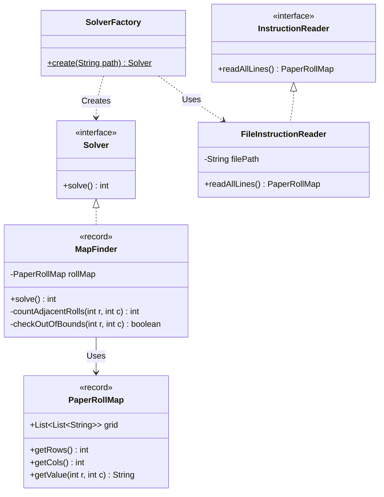
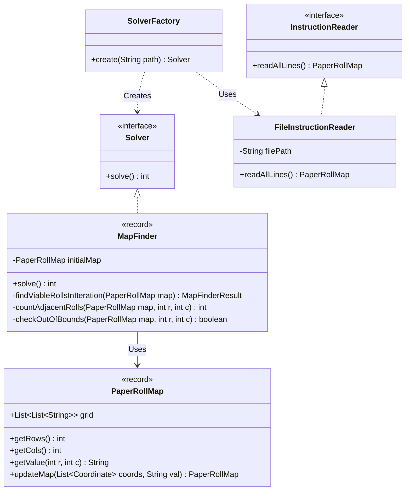

# Advent of Code 2025 - Day 4: Printing Department

Este repositorio contiene la solución para el **Día 4** del Advent of Code 2025, desarrollado en **Java**. El objetivo del reto es optimizar el trabajo de los montacargas en el departamento de impresión del Polo Norte, identificando y eliminando rollos de papel accesibles en una cuadrícula.

## Descripción del Problema

El problema se divide en dos partes diferenciadas que requieren enfoques algorítmicos distintos:

1.  **Parte 1**: Análisis Estático. Calcular cuántos rollos de papel (`@`) son accesibles para un montacargas en un estado inicial dado. Un rollo se considera accesible si tiene **menos de 4** rollos adyacentes en las 8 direcciones posibles.
2.  **Parte 2**: Simulación Dinámica. Implementar un proceso iterativo donde la eliminación de rollos accesibles altera el entorno, potencialmente haciendo accesibles nuevos rollos. El objetivo es determinar el número total de rollos eliminados hasta que el sistema alcanza un estado estable.

## Arquitectura y Principios de Diseño

El diseño de la solución prioriza la **independencia modular**, la **mantenibilidad** y la estricta aplicación de principios de ingeniería de software (SOLID).

### Modularidad e Independencia

El código se estructura en dos paquetes principales (`software.aoc.day4.a` y `software.aoc.day4.b`) que operan como módulos autónomos.

- **Aislamiento Total**: Se ha implementado una arquitectura de "Desacoplamiento Cero" (Zero Coupling). No existe código compartido entre las partes A y B.
- **Justificación**: Aunque esto conlleva la duplicación de estructuras de datos básicas (`Coordinate`, `PaperRollMap`), garantiza que la evolución compleja de la Parte 2 (que requiere mutabilidad y recálculo de estados) no introduzca riesgos de regresión ni complejidad accidental en la lógica más simple de la Parte 1.

### Diagrama de Clases apartado A

El siguiente diagrama ilustra la estructura de las clases y sus relaciones en el paquete `software.aoc.day4.a`.

### Diagrama de Clases apartado B

El siguiente diagrama ilustra la estructura para el paquete `software.aoc.day4.b`, destacando la mutabilidad controlada.

### Patrones de Diseño Utilizados

#### Factory Method

Implementado a través de `SolverFactory` en cada paquete.

- **Propósito**: Abstraer la complejidad de la creación y configuración del grafo de objetos necesario para resolver el problema.
- **Beneficio**: La clase principal `Main` permanece limpia y agnóstica a los detalles de implementación (como, por ejemplo, qué tipo de `InstructionReader` se está utilizando concretamente).

### Principios SOLID

1.  **Single Responsibility Principle (SRP)**:

    - `FileInstructionReader`: Exclusivamente I/O y parsing.
    - `PaperRollMap`: Modelo de dominio puro.
    - `MapFinder`: Lógica algorítmica.

2.  **Dependency Inversion Principle (DIP)**:

    - El sistema de alto nivel depende de abstracciones (`Solver`, `InstructionReader`) y no de implementaciones concretas, facilitando la testabilidad y el reemplazo de componentes.

3.  **Interface Segregation Principle (ISP)**:
    - Las interfaces se mantienen pequeñas y específicas para el contexto de cada paquete, evitando forzar implementaciones innecesarias.

## Ejecución del Proyecto

El proyecto es una aplicación Java estándar gestionada con Maven.

### Requisitos

- Java 17 o superior.
- Maven.

### Cómo Ejecutar

Cada parte cuenta con su propio punto de entrada independiente:

- **Parte 1**: Ejecutar `software.aoc.day4.a.Main`
- **Parte 2**: Ejecutar `software.aoc.day4.b.Main`

Ambas soluciones esperan encontrar el archivo de datos de entrada en la ruta relativa: `src/main/resources/map.txt`.
